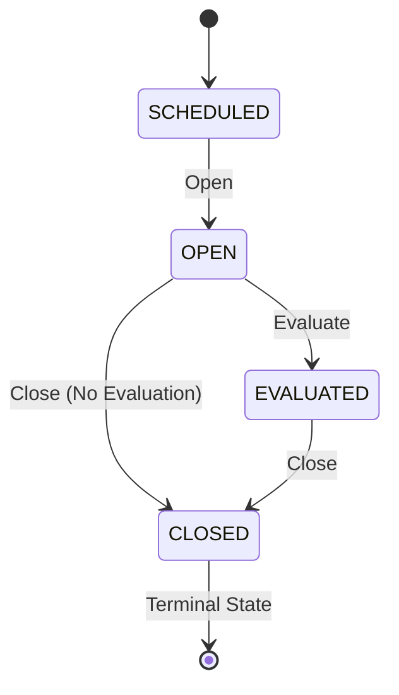

## PATCH /api/v1/sorteos/:id/close

Transitions a sorteo to `CLOSED` status, marking it as finalized. This operation also cascades to all associated tickets.

<Warning>
  Closing a sorteo is **irreversible**. Once closed, the sorteo cannot be reopened and no further operations are allowed.
</Warning>

### Authentication

Requires **ADMIN** role.

### Path Parameters

<ParamField path="id" type="string" required>
  UUID of the sorteo to close
</ParamField>

### Request Body

No request body required.

### Response

<ResponseField name="success" type="boolean">
  Indicates if the operation was successful
</ResponseField>

<ResponseField name="data" type="object">
  The updated sorteo object with `status: "CLOSED"`
</ResponseField>

### Example Request

```bash
curl -X PATCH https://api.example.com/api/v1/sorteos/7c9e6679-7425-40de-944b-e07fc1f90ae7/close \
  -H "Authorization: Bearer YOUR_TOKEN"
```

### Example Response

```json
{
  "success": true,
  "data": {
    "id": "7c9e6679-7425-40de-944b-e07fc1f90ae7",
    "loteriaId": "550e8400-e29b-41d4-a716-446655440000",
    "scheduledAt": "2025-03-03T12:55:00-06:00",
    "name": "Lotto 12:55 PM",
    "status": "CLOSED",
    "digits": 2,
    "isActive": true,
    "reventadoEnabled": true,
    "winningNumber": "42",
    "hasWinner": true,
    "createdAt": "2025-03-03T10:00:00-06:00",
    "updatedAt": "2025-03-03T14:00:00-06:00"
  }
}
```

### Error Responses

<ResponseExample>
```json Invalid Status
{
  "success": false,
  "error": "Solo se puede cerrar desde OPEN o EVALUATED"
}
```

```json Not Found
{
  "success": false,
  "error": "Sorteo no encontrado"
}
```
</ResponseExample>

## Allowed States for Closing

A sorteo can only be closed from:

<CardGroup cols={2}>
  <Card title="OPEN" icon="door-open">
    Close without evaluation (no winning number set).
    
    Use case: Cancelled or void draws
  </Card>
  
  <Card title="EVALUATED" icon="calculator">
    Close after evaluation (winning number set, winners identified).
    
    Use case: Normal draw completion
  </Card>
</CardGroup>

## Cascade Effect

<Warning>
  Closing a sorteo automatically closes all associated tickets through a cascade operation.
</Warning>

The close operation:

1. Updates sorteo status to `CLOSED`
2. Finds all active, non-cancelled tickets for this sorteo
3. Marks each ticket with `deletedByCascade: true`
4. Records cascade metadata (source, reason, timestamp)
5. Invalidates sorteo cache

Example ticket cascade:

```json
{
  "ticketId": "ticket-uuid",
  "status": "EVALUATED",
  "deletedByCascade": true,
  "deletedByCascadeFrom": "sorteo",
  "deletedByCascadeId": "sorteo-uuid"
}
```

## What Happens When Closing?

<AccordionGroup>
  <Accordion title="Status Transition" icon="arrow-right">
    Sorteo status changes to `CLOSED` (terminal state).
  </Accordion>
  
  <Accordion title="Ticket Cascade" icon="link">
    All associated tickets are marked as closed with cascade flags.
    
    Query result:
    ```sql
    UPDATE "Ticket"
    SET "deletedByCascade" = true,
        "deletedByCascadeFrom" = 'sorteo',
        "deletedByCascadeId" = 'sorteo-uuid'
    WHERE "sorteoId" = 'sorteo-uuid'
      AND "status" != 'CANCELLED'
      AND "isActive" = true
      AND "deletedAt" IS NULL;
    ```
  </Accordion>
  
  <Accordion title="Cache Invalidation" icon="trash">
    Sorteo cache is cleared to ensure all clients see the updated status.
  </Accordion>
  
  <Accordion title="Activity Logged" icon="clipboard">
    Activity log entry includes cascade count:
    
    ```json
    {
      "action": "SORTEO_CLOSE",
      "details": {
        "from": "EVALUATED",
        "to": "CLOSED",
        "ticketsClosed": 147,
        "description": "Sorteo Lotto 12:55 PM CERRADO (147 tickets afectados)"
      }
    }
    ```
  </Accordion>
</AccordionGroup>

## Close vs Cancel

<Tabs>
  <Tab title="Close (CLOSED)">
    **Normal completion** of a sorteo lifecycle.
    
    - Sorteo may or may not have winning number
    - All tickets are preserved (just marked as cascade-closed)
    - Used for normal end-of-life
    - **Irreversible**
  </Tab>
  
  <Tab title="Delete/Deactivate">
    **Soft deletion** to hide a sorteo.
    
    - Sets `isActive: false` and `deletedAt`
    - Tickets remain active
    - Can be restored with `/restore` endpoint
    - Used for administrative corrections
  </Tab>
</Tabs>

## Automated Closing

<Info>
  Sorteos can be closed automatically using the auto-close cron job for sorteos with no sales. See [Sorteo Automation](/operations/jobs#sorteo-auto-close) for details.
</Info>

Configuration:

```json
{
  "autoCloseEnabled": true,
  "closeCronSchedule": "*/10 * * * *"
}
```

Auto-close criteria:
- Status is `OPEN`
- No tickets sold
- Scheduled time has passed

## Typical Workflow

<Steps>
  <Step title="Sorteo Opens">
    Sorteo transitions from `SCHEDULED` to `OPEN`.
  </Step>
  
  <Step title="Tickets Sold">
    Vendedores create tickets throughout the sales period.
  </Step>
  
  <Step title="Sales Cutoff">
    Sales automatically stop based on cutoff time.
  </Step>
  
  <Step title="Draw Occurs">
    Physical lottery draw happens (external to system).
  </Step>
  
  <Step title="Evaluation">
    Admin evaluates sorteo with winning number via [Evaluate](/api/sorteos/evaluate).
  </Step>
  
  <Step title="Winners Pay Out">
    Winning tickets are paid via [Payment API](/api/payments/pay-ticket).
  </Step>
  
  <Step title="Close Sorteo">
    Admin closes sorteo to finalize and archive.
  </Step>
</Steps>

## When to Close

<AccordionGroup>
  <Accordion title="After All Winners Paid" icon="check">
    **Best Practice**: Close after all winning tickets have been paid out.
    
    This ensures:
    - Complete payment records
    - Accurate financial reporting
    - No pending operations
  </Accordion>
  
  <Accordion title="No Sales (Auto-Close)" icon="ban">
    Sorteos with zero tickets can be auto-closed to clean up.
    
    Prevents:
    - Clutter in sorteo lists
    - Confusion about active draws
  </Accordion>
  
  <Accordion title="Void/Cancelled Draws" icon="xmark">
    If a draw is cancelled or void, close without evaluation.
    
    All tickets remain in their current state (no winners marked).
  </Accordion>
</AccordionGroup>

## State Diagram



## Related Endpoints

<CardGroup cols={2}>
  <Card title="Open Sorteo" icon="door-open" href="/api/sorteos/open">
    Open a sorteo for sales
  </Card>
  <Card title="Evaluate Sorteo" icon="calculator" href="/api/sorteos/evaluate">
    Set winning number before closing
  </Card>
  <Card title="Ticket Payments" icon="money-bill" href="/api/payments/pay-ticket">
    Pay winning tickets
  </Card>
  <Card title="Activity Logs" icon="list" href="/api/activity/logs">
    View close operation audit
  </Card>
</CardGroup>
