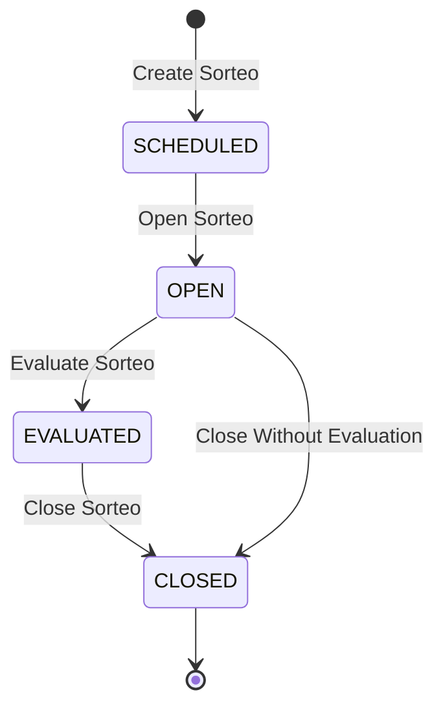

## PATCH /api/v1/sorteos/:id/open

Transitions a sorteo from `SCHEDULED` to `OPEN` status, enabling ticket sales.

<Info>
  Once opened, vendedores can create tickets for this sorteo until it's closed or the sales cutoff time is reached.
</Info>

### Authentication

Requires **ADMIN** role.

### Path Parameters

<ParamField path="id" type="string" required>
  UUID of the sorteo to open
</ParamField>

### Request Body

No request body required.

### Response

<ResponseField name="success" type="boolean">
  Indicates if the operation was successful
</ResponseField>

<ResponseField name="data" type="object">
  The updated sorteo object with `status: "OPEN"`
</ResponseField>

### Example Request

```bash
curl -X PATCH https://api.example.com/api/v1/sorteos/7c9e6679-7425-40de-944b-e07fc1f90ae7/open \
  -H "Authorization: Bearer YOUR_TOKEN"
```

### Example Response

```json
{
  "success": true,
  "data": {
    "id": "7c9e6679-7425-40de-944b-e07fc1f90ae7",
    "loteriaId": "550e8400-e29b-41d4-a716-446655440000",
    "scheduledAt": "2025-03-03T12:55:00-06:00",
    "name": "Lotto 12:55 PM",
    "status": "OPEN",
    "digits": 2,
    "isActive": true,
    "reventadoEnabled": true,
    "winningNumber": null,
    "hasWinner": false,
    "createdAt": "2025-03-03T10:00:00-06:00",
    "updatedAt": "2025-03-03T10:30:00-06:00"
  }
}
```

### Error Responses

<ResponseExample>
```json Not Scheduled
{
  "success": false,
  "error": "Solo se puede abrir desde SCHEDULED"
}
```

```json Inactive Sorteo
{
  "success": false,
  "error": "No se puede abrir un sorteo inactivo"
}
```

```json Not Found
{
  "success": false,
  "error": "Sorteo no encontrado"
}
```
</ResponseExample>

## Opening Requirements

<Steps>
  <Step title="Sorteo Must Be Scheduled">
    Only sorteos with `status: "SCHEDULED"` can be opened.
  </Step>
  
  <Step title="Sorteo Must Be Active">
    The sorteo's `isActive` field must be `true`.
  </Step>
  
  <Step title="Admin Permission">
    Only users with ADMIN role can open sorteos.
  </Step>
</Steps>

## Alternative: Force Open

For reopening sorteos from other states, see the Update endpoint for advanced options.

<Note>
  Additional endpoints like force-open and activate-and-open are available but not yet documented. These allow forcefully opening sorteos from any non-evaluated state or reactivating inactive sorteos.
</Note>

## What Happens When Opening?

<AccordionGroup>
  <Accordion title="Status Transition" icon="arrow-right">
    The sorteo status changes from `SCHEDULED` to `OPEN`.
  </Accordion>
  
  <Accordion title="Ticket Sales Enabled" icon="ticket">
    Vendedores can now create tickets for this sorteo through the ticket creation API.
  </Accordion>
  
  <Accordion title="Cache Invalidation" icon="trash">
    Sorteo cache is cleared to ensure all clients see the updated status.
  </Accordion>
  
  <Accordion title="Activity Logged" icon="clipboard">
    An activity log entry is created:
    
    ```json
    {
      "action": "SORTEO_OPEN",
      "targetType": "SORTEO",
      "targetId": "sorteo-uuid",
      "details": {
        "from": "SCHEDULED",
        "to": "OPEN",
        "description": "Sorteo Lotto 12:55 PM (Lotto) del 2025-03-03 12:55:00 -0600 ABIERTO"
      }
    }
    ```
  </Accordion>
</AccordionGroup>

## Sales Cutoff

<Warning>
  Sales are automatically cut off based on the loteria's configuration, typically 5 minutes before the scheduled time.
</Warning>

Example cutoff logic:

```typescript
const sorteoTime = new Date(sorteo.scheduledAt);
const cutoffMinutes = 5;
const cutoffTime = new Date(sorteoTime.getTime() - (cutoffMinutes * 60 * 1000));

if (currentTime > cutoffTime) {
  throw new Error('Sales closed for this sorteo');
}
```

The cutoff is enforced at ticket creation time, not when opening the sorteo.

## Automated Opening

<Info>
  Sorteos can be opened automatically using the auto-open cron job. See [Sorteo Automation](/operations/jobs#sorteo-auto-open) for details.
</Info>

Configuration:

```json
{
  "autoOpenEnabled": true,
  "openCronSchedule": "0 7 * * *"
}
```

## Typical Workflow

<Steps>
  <Step title="Create Sorteos">
    Create sorteos manually or via [seed sorteos](/api/loterias/seed-sorteos) for upcoming draws.
  </Step>
  
  <Step title="Schedule Auto-Open">
    Configure auto-open to run at specific times (e.g., 1 AM daily).
  </Step>
  
  <Step title="Sorteos Open Automatically">
    Sorteos scheduled for today are opened automatically by the cron job.
  </Step>
  
  <Step title="Vendedores Sell Tickets">
    Vendedores create tickets throughout the day until cutoff time.
  </Step>
  
  <Step title="Close Before Draw">
    Sales cutoff prevents new tickets close to draw time.
  </Step>
  
  <Step title="Evaluate After Draw">
    Admin evaluates sorteo with winning number using [Evaluate Sorteo](/api/sorteos/evaluate).
  </Step>
</Steps>

## State Diagram



## Related Endpoints

<CardGroup cols={2}>
  <Card title="Close Sorteo" icon="lock" href="/api/sorteos/close">
    Close an open or evaluated sorteo
  </Card>
  <Card title="Evaluate Sorteo" icon="calculator" href="/api/sorteos/evaluate">
    Set winning number and evaluate
  </Card>
  <Card title="Update Sorteo" icon="pen" href="/api/sorteos/update">
    Modify sorteo configuration
  </Card>
  <Card title="Create Ticket" icon="ticket" href="/api/tickets/create">
    Create a ticket for open sorteo
  </Card>
</CardGroup>
