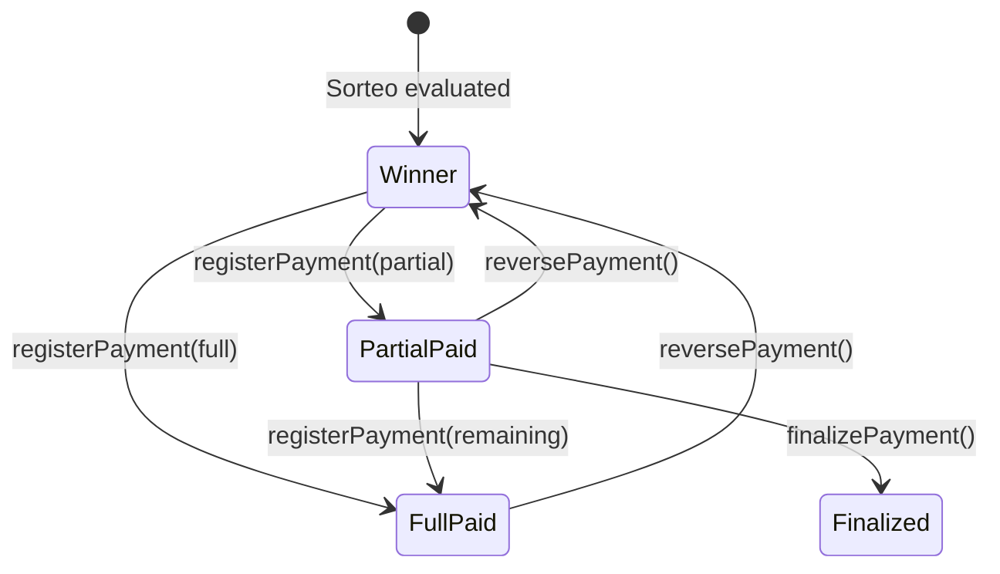

## Overview

The payment system handles disbursement of winnings to ticket holders. It supports full payments, partial payments, payment reversal, and finalization of partial payments.

## Payment Workflow



## Payment States

| Ticket Status | Description | Can Pay? | Can Reverse? |
|--------------|-------------|----------|-------------|
| **EVALUATED** (unpaid) | Winning ticket, no payment | ✅ Yes | ❌ No |
| **EVALUATED** (partial) | Some amount paid, balance remains | ✅ Yes | ✅ Last payment |
| **PAID** | Fully paid | ❌ No | ✅ Last payment |
| **FINALIZED** | Partial payment accepted as final | ❌ No | ✅ Last payment |

## Registering Payments

### Full Payment

Pay the complete prize amount in one transaction.

<CodeGroup>
  ```bash cURL
  curl -X POST https://api.example.com/api/v1/tickets/:id/pay \
    -H "Authorization: Bearer YOUR_TOKEN" \
    -H "Content-Type: application/json" \
    -d '{
      "amount": 15000,
      "paymentMethod": "CASH",
      "notes": "Paid in full at main office"
    }'
  ```

  ```javascript JavaScript
  const response = await fetch(`/api/v1/tickets/${ticketId}/pay`, {
    method: 'POST',
    headers: {
      'Authorization': `Bearer ${token}`,
      'Content-Type': 'application/json'
    },
    body: JSON.stringify({
      amount: 15000,
      paymentMethod: 'CASH',
      notes: 'Paid in full at main office'
    })
  });
  ```
</CodeGroup>

From `src/api/v1/controllers/ticket.controller.ts:173-183`:

```typescript
async registerPayment(req: AuthenticatedRequest, res: Response) {
  const userId = req.user!.id;
  const ticketId = req.params.id;
  const result = await TicketService.registerPayment(
    ticketId,
    req.body,
    userId,
    req.requestId
  );
  return success(res, result);
}
```

### Partial Payment

Pay a portion of the prize, with remaining balance tracked.

```json
{
  "amount": 5000,
  "paymentMethod": "CASH",
  "notes": "Partial payment 1 of 3"
}
```

**Example scenario:**
- Total payout: ₡15,000
- Payment 1: ₡5,000 → `remainingAmount = 10,000`
- Payment 2: ₡5,000 → `remainingAmount = 5,000`
- Payment 3: ₡5,000 → `remainingAmount = 0`, `status = PAID`

### Payment Methods

```typescript
type PaymentMethod = 
  | 'CASH'           // Cash payment
  | 'BANK_TRANSFER'  // Bank transfer
  | 'MOBILE_PAYMENT' // Mobile money (Sinpe Móvil)
  | 'CHECK'          // Check payment
  | 'OTHER';         // Other method
```

## Payment Tracking

### Ticket Payment Fields

```typescript
{
  totalPayout: number;      // Total prize amount
  totalPaid: number;        // Sum of all payments
  remainingAmount: number;  // Unpaid balance
  status: 'EVALUATED' | 'PAID' | 'FINALIZED';
  lastPaymentAt: Date | null;
}
```

### Get Payment History

```bash
GET /api/v1/tickets/:ticketId/payment-history
```

From `src/api/v1/controllers/ticketPayment.controller.ts:170-181`:

```typescript
async getPaymentHistory(req: AuthenticatedRequest, res: Response) {
  if (!req.user) throw new AppError("Unauthorized", 401);
  const { ticketId } = req.params;
  
  const result = await TicketPaymentService.getPaymentHistory(ticketId, {
    id: req.user.id,
    role: req.user.role,
    ventanaId: req.user.ventanaId,
  });
  
  return success(res, result);
}
```

**Response:**
```json
{
  "payments": [
    {
      "id": "uuid-payment-1",
      "amount": 5000,
      "paymentMethod": "CASH",
      "notes": "Partial payment 1",
      "createdAt": "2025-01-20T10:00:00.000Z",
      "createdBy": {
        "id": "uuid-user",
        "name": "Juan Pérez"
      }
    },
    {
      "id": "uuid-payment-2",
      "amount": 5000,
      "paymentMethod": "CASH",
      "notes": "Partial payment 2",
      "createdAt": "2025-01-20T14:00:00.000Z",
      "createdBy": {...}
    }
  ],
  "summary": {
    "totalPayout": 15000,
    "totalPaid": 10000,
    "remainingAmount": 5000
  }
}
```

## Reversing Payments

Revert the most recent payment (undo last transaction).

```bash
POST /api/v1/tickets/:id/reverse-payment
```

```json
{
  "reason": "Payment error - wrong amount entered"
}
```

From `src/api/v1/controllers/ticket.controller.ts:189-200`:

```typescript
async reversePayment(req: AuthenticatedRequest, res: Response) {
  const userId = req.user!.id;
  const ticketId = req.params.id;
  const { reason } = req.body;
  const result = await TicketService.reversePayment(
    ticketId,
    userId,
    reason,
    req.requestId
  );
  return success(res, result);
}
```

<Warning>
  **Reversal rules:**
  - Only the **last payment** can be reversed
  - Cannot reverse if new payments were made after
  - Ticket status reverts to previous state
  - `totalPaid` and `remainingAmount` are recalculated
  - All reversals are logged in `ActivityLog`
</Warning>

## Finalizing Partial Payments

Mark a partial payment as final, accepting remaining debt.

```bash
POST /api/v1/tickets/:id/finalize-payment
```

```json
{
  "notes": "Customer agreed to accept ₡10,000 instead of full ₡15,000 due to operational limits"
}
```

From `src/api/v1/controllers/ticket.controller.ts:206-217`:

```typescript
async finalizePayment(req: AuthenticatedRequest, res: Response) {
  const userId = req.user!.id;
  const ticketId = req.params.id;
  const { notes } = req.body;
  const result = await TicketService.finalizePayment(
    ticketId,
    userId,
    notes,
    req.requestId
  );
  return success(res, result);
}
```

**Effects:**
- Ticket `status` changes to `FINALIZED`
- `remainingAmount` stays as-is (not zeroed)
- No further payments can be registered
- Finance team can track unpaid balance

<Note>
  Use finalization when:
  - Customer accepts partial payment as settlement
  - Operational cash limits prevent full payout
  - Agreement reached for installment completion later
</Note>

## TicketPayment Entity

Dedicated payment records in `TicketPayment` model.

### Create Payment (Standalone API)

```bash
POST /api/v1/ticket-payments
```

From `src/api/v1/controllers/ticketPayment.controller.ts:19-55`:

```typescript
async create(req: AuthenticatedRequest, res: Response) {
  if (!req.user) throw new AppError("Unauthorized", 401);
  
  const validatedData = CreatePaymentSchema.parse(req.body);
  
  const result = await TicketPaymentService.create(validatedData, {
    id: req.user.id,
    role: req.user.role,
    ventanaId: req.user.ventanaId,
  });
  
  // Check if cached response (idempotency)
  const isCached = (result as any).cached === true;
  const statusCode = isCached ? 200 : 201;
  
  return res.status(statusCode).json({
    success: true,
    data: result,
    ...(isCached ? { meta: { cached: true } } : {})
  });
}
```

**Request body:**
```json
{
  "ticketId": "uuid-ticket",
  "amount": 5000,
  "paymentMethod": "CASH",
  "notes": "Payment note",
  "idempotencyKey": "unique-key-123"  // Optional, prevents duplicates
}
```

### Idempotency Support

<Note>
  Include `idempotencyKey` to prevent duplicate payments on network retry:
  - Same key returns cached payment with `200 OK` and `meta.cached: true`
  - Different key creates new payment with `201 Created`
</Note>

### List All Payments

```bash
GET /api/v1/ticket-payments?ventanaId=uuid&status=PAID&page=1&pageSize=20
```

**Query parameters:**
- `ventanaId`: Filter by ventana
- `vendedorId`: Filter by vendedor
- `ticketId`: Filter by specific ticket
- `status`: Filter by status
- `fromDate`, `toDate`: Date range (YYYY-MM-DD)
- `sortBy`: `createdAt` | `amount` | `ticketNumber`
- `sortOrder`: `asc` | `desc`
- `page`, `pageSize`: Pagination

From `src/api/v1/controllers/ticketPayment.controller.ts:61-96`:

```typescript
async list(req: AuthenticatedRequest, res: Response) {
  if (!req.user) throw new AppError("Unauthorized", 401);
  
  const validatedQuery = ListPaymentsQuerySchema.parse(req.query);
  
  const result = await TicketPaymentService.list(
    validatedQuery.page,
    validatedQuery.pageSize,
    filters,
    {
      id: req.user.id,
      role: req.user.role,
      ventanaId: req.user.ventanaId,
    }
  );
  
  return success(res, result);
}
```

### Get Payment Details

```bash
GET /api/v1/ticket-payments/:id
```

From `src/api/v1/controllers/ticketPayment.controller.ts:102-113`:

```typescript
async getById(req: AuthenticatedRequest, res: Response) {
  if (!req.user) throw new AppError("Unauthorized", 401);
  const { id } = req.params;
  
  const result = await TicketPaymentService.getById(id, {
    id: req.user.id,
    role: req.user.role,
    ventanaId: req.user.ventanaId,
  });
  
  return success(res, result);
}
```

### Update Payment

```bash
PATCH /api/v1/ticket-payments/:id
```

```json
{
  "notes": "Updated note - payment confirmed by supervisor"
}
```

From `src/api/v1/controllers/ticketPayment.controller.ts:119-138`:

```typescript
async update(req: AuthenticatedRequest, res: Response) {
  if (!req.user) throw new AppError("Unauthorized", 401);
  const { id } = req.params;
  
  const validatedData = UpdatePaymentSchema.parse(req.body);
  
  const result = await TicketPaymentService.update(
    id,
    validatedData,
    req.user.id,
    {
      id: req.user.id,
      role: req.user.role,
      ventanaId: req.user.ventanaId,
    }
  );
  
  return success(res, result);
}
```

### Reverse Payment (Standalone)

```bash
POST /api/v1/ticket-payments/:id/reverse
```

From `src/api/v1/controllers/ticketPayment.controller.ts:144-164`:

```typescript
async reverse(req: AuthenticatedRequest, res: Response) {
  if (!req.user) throw new AppError("Unauthorized", 401);
  const { id } = req.params;
  
  const result = await TicketPaymentService.reverse(id, req.user.id, {
    id: req.user.id,
    role: req.user.role,
    ventanaId: req.user.ventanaId,
  });
  
  await ActivityService.log({
    userId: req.user.id,
    action: "TICKET_PAYMENT_REVERSE" as any,
    targetType: "TICKET_PAYMENT",
    targetId: id,
    details: { reversed: true },
    layer: "controller",
  });
  
  return success(res, result);
}
```

## Payment Analytics

### Summary Metrics

Payment metrics are included in sales summary endpoints.

```bash
GET /api/v1/ventas/summary?date=today
```

**Response includes:**
```json
{
  "totalPaid": 125000,           // Total paid to winners
  "remainingAmount": 35000,      // Prizes still unpaid
  "paidTicketsCount": 45,        // Fully paid tickets
  "unpaidTicketsCount": 12       // Tickets with pending payment
}
```

### Dashboard Payment Tracking

```bash
GET /api/v1/admin/dashboard?date=today
```

From `src/api/v1/controllers/dashboard.controller.ts:44-74`:

```typescript
async getMainDashboard(req: AuthenticatedRequest, res: Response) {
  // ... date and RBAC logic
  
  const result = await DashboardService.getFullDashboard({
    fromDate: dateRange.fromAt,
    toDate: dateRange.toAt,
    ventanaId,
    bancaId,
    loteriaId: query.loteriaId,
    betType: query.betType,
    interval: query.interval,
    scope: query.scope || 'all',
    dimension: query.dimension,
  }, req.user!.role);
  
  return success(res, result);
}
```

**Includes payment KPIs:**
```json
{
  "payments": {
    "totalPaid": 125000,
    "remainingAmount": 35000,
    "paidCount": 45,
    "unpaidCount": 12
  }
}
```

## Best Practices

<AccordionGroup>
  <Accordion title="Always use idempotency keys">
    Include `idempotencyKey` in payment requests to prevent duplicates on network retry or user double-click.
  </Accordion>

  <Accordion title="Record detailed notes">
    Include `notes` field with payment context: location, payment method details, supervisor approval, etc.
  </Accordion>

  <Accordion title="Verify ticket status before payment">
    Always fetch ticket details first to check:
    - `status === 'EVALUATED'` (not already paid)
    - `remainingAmount > 0`
    - `totalPayout` matches expectation
  </Accordion>

  <Accordion title="Handle partial payments gracefully">
    For large prizes:
    - Show `remainingAmount` prominently
    - Allow multiple small payments
    - Track payment history in UI
    - Use finalization when appropriate
  </Accordion>

  <Accordion title="Implement reversal workflow">
    Require supervisor approval for payment reversals. Log detailed reasons.
  </Accordion>
</AccordionGroup>

## Common Workflows

### Full Payment Flow

<Steps>
  <Step title="Verify ticket is winner">
    ```bash
    GET /api/v1/tickets/:id
    ```
    Check: `status === 'EVALUATED'` and `totalPayout > 0`
  </Step>

  <Step title="Register payment">
    ```bash
    POST /api/v1/tickets/:id/pay
    ```
    Amount = `totalPayout`
  </Step>

  <Step title="Verify completion">
    Response should show:
    - `totalPaid === totalPayout`
    - `remainingAmount === 0`
    - `status === 'PAID'`
  </Step>
</Steps>

### Partial Payment Flow

<Steps>
  <Step title="First partial payment">
    ```bash
    POST /api/v1/tickets/:id/pay
    ```
    Amount < `totalPayout`
  </Step>

  <Step title="Track remaining balance">
    Response shows updated `remainingAmount`
  </Step>

  <Step title="Subsequent payments">
    Repeat until `remainingAmount === 0` or finalize
  </Step>

  <Step title="Optional: Finalize">
    If stopping before full payment:
    ```bash
    POST /api/v1/tickets/:id/finalize-payment
    ```
  </Step>
</Steps>

## Related Guides

- [Ticket Creation](/guides/ticket-creation) - Understanding ticket lifecycle
- [Sorteo Management](/guides/sorteo-management) - Evaluation triggers payment eligibility
- [Analytics](/guides/analytics) - Payment tracking and reports