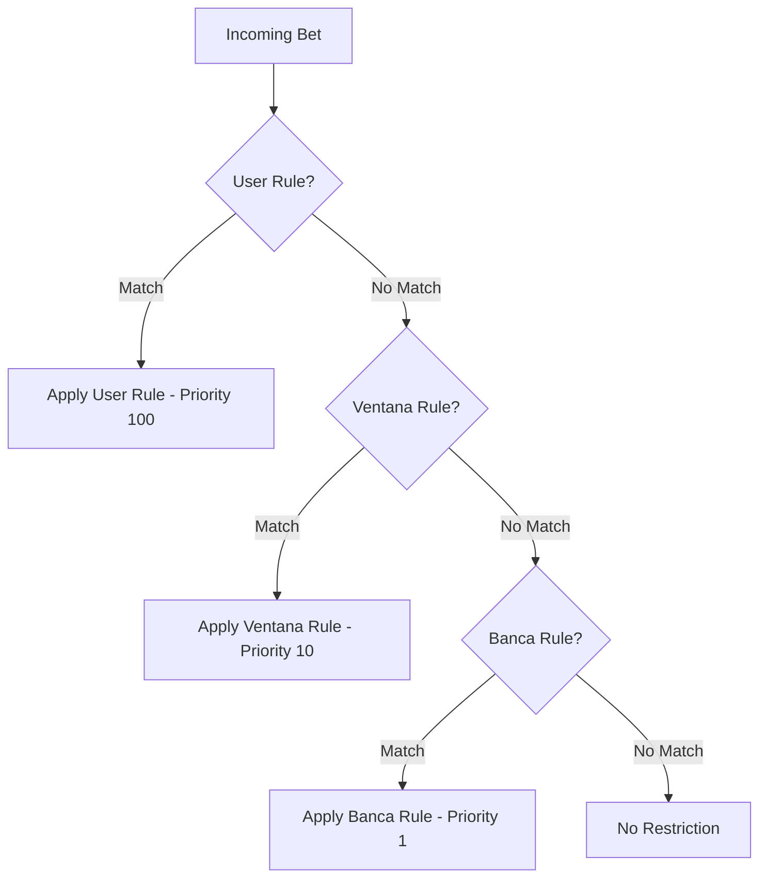

## Overview

Restriction rules control betting limits across the system with hierarchical priority. Rules can be scoped to **Banca**, **Ventana**, or **User** (vendedor) level, with optional filters for specific numbers, lotteries, sorteos, dates, and times.

## Rule Hierarchy

Rules are applied using **first match wins** logic with priority:



<Note>
  **Priority levels:**
  - User (vendedor): **100**
  - Ventana: **10**
  - Banca: **1**
  
  The highest priority matching rule is applied. Lower priority rules are ignored.
</Note>

## Rule Types

### 1. Per-Number Limits

Restrict maximum bet amount for specific lottery numbers.

```json
{
  "loteriaId": "uuid-loteria",
  "number": "25",
  "maxAmount": 5000,
  "scope": "BANCA",
  "entityId": "uuid-banca"
}
```

**Use case:** Popular numbers (25, 50, 75) often need lower limits to reduce risk exposure.

### 2. Global Ticket Limits

Restrict maximum total per ticket (all jugadas combined).

```json
{
  "loteriaId": "uuid-loteria",
  "number": null,  // null = applies to all numbers
  "maxTotal": 50000,
  "scope": "VENTANA",
  "entityId": "uuid-ventana"
}
```

### 3. Sales Cutoff Rules

Define minutes before draw when sales must stop.

```json
{
  "loteriaId": "uuid-loteria",
  "number": null,
  "salesCutoffMinutes": 10,
  "scope": "USER",
  "entityId": "uuid-vendedor"
}
```

**Resolution priority:**
1. RestrictionRule (User → Ventana → Banca)
2. `Loteria.rulesJson.closingTimeBeforeDraw`
3. Default: 5 minutes

### 4. Date/Time Specific Rules

Apply rules only on specific dates or hours.

```json
{
  "loteriaId": "uuid-loteria",
  "number": "00",
  "maxAmount": 2000,
  "appliesToDate": "2025-01-20",  // Only on this date
  "appliesToHour": "18:00",       // Only for 6 PM draws
  "scope": "BANCA",
  "entityId": "uuid-banca"
}
```

## Creating Rules

### Single Number Rule

<CodeGroup>
  ```bash cURL
  curl -X POST https://api.example.com/api/v1/restrictions \
    -H "Authorization: Bearer YOUR_TOKEN" \
    -H "Content-Type: application/json" \
    -d '{
      "scope": "BANCA",
      "entityId": "uuid-banca",
      "loteriaId": "uuid-loteria",
      "number": "25",
      "maxAmount": 5000,
      "salesCutoffMinutes": 10
    }'
  ```

  ```javascript JavaScript
  const response = await fetch('/api/v1/restrictions', {
    method: 'POST',
    headers: {
      'Authorization': `Bearer ${token}`,
      'Content-Type': 'application/json'
    },
    body: JSON.stringify({
      scope: 'BANCA',
      entityId: 'uuid-banca',
      loteriaId: 'uuid-loteria',
      number: '25',
      maxAmount: 5000,
      salesCutoffMinutes: 10
    })
  });
  ```
</CodeGroup>

### Batch Number Rules (v1.1.1+)

Create multiple rules for different numbers in a single request.

```json
{
  "scope": "VENTANA",
  "entityId": "uuid-ventana",
  "loteriaId": "uuid-loteria",
  "number": ["00", "01", "25", "50", "75", "99"],  // Array of numbers
  "maxAmount": 3000
}
```

<Note>
  **Batch creation rules:**
  - Maximum 100 numbers per request
  - All numbers must be 2 digits (00-99)
  - No duplicates allowed
  - All rules share same `maxAmount`, `maxTotal`, `salesCutoffMinutes`
  - Legacy single-number format still supported: `"number": "25"`
</Note>

## Listing Rules

```bash
GET /api/v1/restrictions?scope=BANCA&entityId=uuid-banca&loteriaId=uuid-loteria
```

**Query parameters:**
- `scope`: `BANCA` | `VENTANA` | `USER`
- `entityId`: UUID of banca/ventana/user
- `loteriaId`: Filter by lottery
- `sorteoId`: Filter by specific sorteo
- `number`: Filter by specific number
- `isActive`: `true` | `false` (default: true)
- `page`, `pageSize`: Pagination

From `src/api/v1/controllers/restrictionRule.controller.ts:46-72`:

```typescript
async list(req: AuthenticatedRequest, res: Response) {
  const query = req.query as any;
  
  // If ADMIN with active banca context, filter by bancaId
  if (req.user!.role === 'ADMIN' && req.bancaContext?.bancaId && req.bancaContext.hasAccess) {
    query.bancaId = req.bancaContext.bancaId;
  }
  
  const result = await RestrictionRuleService.list(query);
  res.json({ success: true, data: result.data, meta: result.meta });
}
```

## My Restrictions (Vendedor View)

Get all effective restrictions for the authenticated vendedor, including inherited rules from ventana and banca.

```bash
GET /api/v1/restrictions/me
```

From `src/api/v1/controllers/restrictionRule.controller.ts:93-230`:

```typescript
async myRestrictions(req: AuthenticatedRequest, res: Response) {
  const me = req.user!;
  const { vendedorId } = req.query as any;
  
  // Build auth context
  const context: AuthContext = {
    userId: me.id,
    role: me.role,
    ventanaId: me.ventanaId,
    bancaId: req.bancaContext?.bancaId || null,
  };
  
  // Apply RBAC filters
  const effectiveFilters = await applyRbacFilters(context, { vendedorId });
  const effectiveVendorId = effectiveFilters.vendedorId || me.id;
  
  const result = await RestrictionRuleService.forVendor(
    effectiveVendorId,
    effectiveBancaId,
    effectiveVentanaId
  );
  
  res.json({ success: true, data: result });
}
```

**Response structure:**
```json
{
  "general": [
    {
      "id": "uuid-rule-1",
      "scope": "BANCA",
      "maxTotal": 50000,
      "salesCutoffMinutes": 10,
      "priority": 1
    }
  ],
  "vendorSpecific": [
    {
      "id": "uuid-rule-2",
      "scope": "USER",
      "number": "25",
      "maxAmount": 3000,
      "priority": 100
    }
  ]
}
```

### Impersonation (ADMIN/VENTANA)

ADMIN and VENTANA users can query restrictions for specific vendedores.

```bash
GET /api/v1/restrictions/me?vendedorId=uuid-vendedor
```

<Note>
  **Permissions:**
  - **ADMIN:** Can query any vendedor
  - **VENTANA:** Can query vendedores in their ventana only
  - **VENDEDOR:** `vendedorId` parameter is ignored, always returns own restrictions
</Note>

## Updating Rules

```bash
PATCH /api/v1/restrictions/:id
```

From `src/api/v1/controllers/restrictionRule.controller.ts:15-22`:

```typescript
async update(req: AuthenticatedRequest, res: Response) {
  const rule = await RestrictionRuleService.update(
    req.user!.id,
    req.params.id,
    req.body
  );
  res.json({ success: true, data: rule });
}
```

**Allowed updates:**
- `maxAmount`
- `maxTotal`
- `salesCutoffMinutes`
- `isActive`
- `appliesToDate`
- `appliesToHour`

<Warning>
  Cannot change `scope`, `entityId`, `loteriaId`, or `number` after creation. Delete and recreate instead.
</Warning>

## Deleting Rules

```bash
DELETE /api/v1/restrictions/:id
```

Optional body:
```json
{
  "reason": "Number restriction no longer needed"
}
```

From `src/api/v1/controllers/restrictionRule.controller.ts:24-31`:

```typescript
async delete(req: AuthenticatedRequest, res: Response) {
  const rule = await RestrictionRuleService.remove(
    req.user!.id,
    req.params.id,
    req.body?.reason
  );
  res.json({ success: true, data: rule });
}
```

<Note>
  Deletion is a **soft delete** (`isActive = false`). Rules can be restored.
</Note>

## Restoring Rules

```bash
PATCH /api/v1/restrictions/:id/restore
```

From `src/api/v1/controllers/restrictionRule.controller.ts:33-38`:

```typescript
async restore(req: AuthenticatedRequest, res: Response) {
  const rule = await RestrictionRuleService.restore(
    req.user!.id,
    req.params.id
  );
  res.json({ success: true, data: rule });
}
```

## Automated Rule Management

The system includes a CRON job that automatically manages time-based rules.

### Check CRON Health

```bash
GET /api/v1/restrictions/cron-health
```

From `src/api/v1/controllers/restrictionRule.controller.ts:74-77`:

```typescript
async getCronHealth(req: AuthenticatedRequest, res: Response) {
  const health = await RestrictionRuleService.getCronHealth();
  res.json({ success: true, data: health });
}
```

**Response:**
```json
{
  "status": "healthy",
  "lastRun": "2025-01-20T10:00:00.000Z",
  "rulesProcessed": 145,
  "nextRun": "2025-01-20T11:00:00.000Z"
}
```

### Execute CRON Manually

```bash
POST /api/v1/restrictions/cron-execute
```

From `src/api/v1/controllers/restrictionRule.controller.ts:79-82`:

```typescript
async executeCronManually(req: AuthenticatedRequest, res: Response) {
  const result = await RestrictionRuleService.executeCronManually();
  res.json({ success: true, data: result });
}
```

## Validation During Ticket Creation

Restriction rules are automatically enforced during ticket creation in `TicketService.create()`.

### Validation Flow

<Steps>
  <Step title="Fetch applicable rules">
    System fetches all rules matching:
    - User/Ventana/Banca hierarchy
    - `loteriaId`
    - `sorteoId` (if specified)
    - `appliesToDate` (if specified)
    - `appliesToHour` (if specified)
  </Step>

  <Step title="Sort by priority">
    Rules are sorted:
    1. Priority level (100 → 10 → 1)
    2. Specificity (number-specific before global)
  </Step>

  <Step title="Apply first matching rule">
    For each jugada, find first rule where:
    - `number` matches (or rule has `number = null`)
    - All time/date filters pass
    
    Apply that rule's `maxAmount` limit.
  </Step>

  <Step title="Check global limits">
    After individual jugada checks, validate:
    - Ticket `totalAmount` ≤ `maxTotal` (from first matching global rule)
    - Sales cutoff not exceeded
  </Step>
</Steps>

## Common Patterns

### Limit Popular Numbers Across System

```bash
POST /api/v1/restrictions
```

```json
{
  "scope": "BANCA",
  "entityId": "uuid-banca",
  "loteriaId": "uuid-loteria",
  "number": ["00", "25", "50", "75", "99"],
  "maxAmount": 3000
}
```

### Vendor-Specific Limit for High Risk

```json
{
  "scope": "USER",
  "entityId": "uuid-vendedor",
  "loteriaId": null,  // All lotteries
  "number": null,     // All numbers
  "maxTotal": 20000   // Max ticket total
}
```

### Event-Specific Restriction

```json
{
  "scope": "BANCA",
  "entityId": "uuid-banca",
  "loteriaId": "uuid-loteria",
  "number": "13",
  "maxAmount": 1000,
  "appliesToDate": "2025-12-25",  // Christmas Day only
  "appliesToHour": "12:00"
}
```

### Extended Cutoff for Specific Sorteo

```json
{
  "scope": "VENTANA",
  "entityId": "uuid-ventana",
  "sorteoId": "uuid-sorteo",  // Specific draw
  "salesCutoffMinutes": 15      // Close 15 min early
}
```

## Best Practices

<AccordionGroup>
  <Accordion title="Use batch creation for number patterns">
    When setting limits for multiple numbers with same restriction, use array format to reduce API calls.
  </Accordion>

  <Accordion title="Start with banca-level defaults">
    Establish baseline limits at BANCA scope, then override for specific ventanas or users as needed.
  </Accordion>

  <Accordion title="Monitor with /me endpoint">
    Vendedores should call `/restrictions/me` on login to cache their effective limits client-side.
  </Accordion>

  <Accordion title="Include reasons for changes">
    Always include `reason` when deleting or updating rules for audit compliance.
  </Accordion>

  <Accordion title="Test with low values first">
    When creating new rules, start with conservative (low) `maxAmount` values and adjust based on actual sales patterns.
  </Accordion>
</AccordionGroup>

## Related Guides

- [Ticket Creation](/guides/ticket-creation) - Understanding how restrictions are enforced
- [Sorteo Management](/guides/sorteo-management) - Setting up draw schedules
- [Analytics](/guides/analytics) - Monitoring exposure and risk