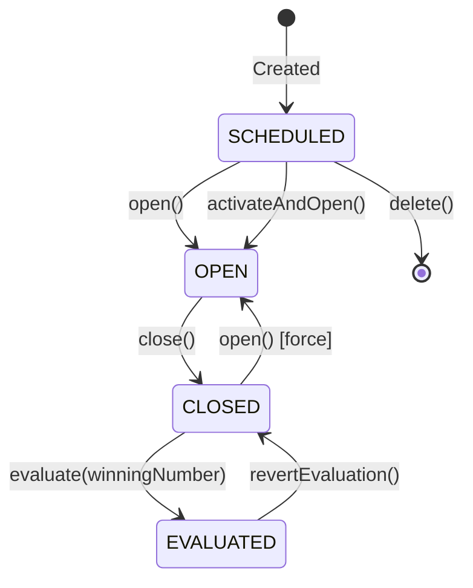

## Overview

Sorteos (lottery draws) follow a strict state machine with four main states. Understanding the lifecycle and valid transitions is critical for managing lottery operations.

## State Machine



## Sorteo States

| State | Description | Ticket Creation | Evaluation |
|-------|-------------|-----------------|------------|
| **SCHEDULED** | Future draw, not yet open | ❌ Blocked | ❌ Blocked |
| **OPEN** | Accepting bets | ✅ Allowed | ❌ Blocked |
| **CLOSED** | Betting closed, awaiting results | ❌ Blocked | ✅ Allowed |
| **EVALUATED** | Results published, tickets evaluated | ❌ Blocked | ✅ Can revert |

## State Transitions

### SCHEDULED → OPEN

<Steps>
  <Step title="Activate sorteo">
    Manually open a scheduled sorteo for betting.

    ```bash
    PATCH /api/v1/sorteos/:id/open
    ```

    From `src/api/v1/controllers/sorteo.controller.ts:22-25`:

    ```typescript
    async open(req: AuthenticatedRequest, res: Response) {
      const s = await SorteoService.open(req.params.id, req.user!.id);
      res.json({ success: true, data: s });
    }
    ```
  </Step>

  <Step title="Or activate and open in one call">
    Combine `isActive = true` and status transition:

    ```bash
    PATCH /api/v1/sorteos/:id/activate-and-open
    ```

    From `src/api/v1/controllers/sorteo.controller.ts:32-35`:

    ```typescript
    async activateAndOpen(req: AuthenticatedRequest, res: Response) {
      const s = await SorteoService.activateAndOpen(req.params.id, req.user!.id);
      res.json({ success: true, data: s });
    }
    ```
  </Step>
</Steps>

<Note>
  Opening a sorteo makes it visible to vendedores and enables ticket creation.
</Note>

### OPEN → CLOSED

Close betting before evaluating results.

```bash
PATCH /api/v1/sorteos/:id/close
```

From `src/api/v1/controllers/sorteo.controller.ts:37-40`:

```typescript
async close(req: AuthenticatedRequest, res: Response) {
  const s = await SorteoService.close(req.params.id, req.user!.id);
  res.json({ success: true, data: s });
}
```

**Use case:** Manual close before scheduled draw time.

### CLOSED → EVALUATED

Evaluate sorteo with winning number and optional REVENTADO multiplier.

<CodeGroup>
  ```bash Basic evaluation (NUMERO only)
  curl -X PATCH https://api.example.com/api/v1/sorteos/:id/evaluate \
    -H "Authorization: Bearer YOUR_TOKEN" \
    -H "Content-Type: application/json" \
    -d '{
      "winningNumber": "42"
    }'
  ```

  ```bash With REVENTADO winner
  curl -X PATCH https://api.example.com/api/v1/sorteos/:id/evaluate \
    -H "Authorization: Bearer YOUR_TOKEN" \
    -H "Content-Type: application/json" \
    -d '{
      "winningNumber": "42",
      "extraMultiplierId": "uuid-reventado-multiplier",
      "extraOutcomeCode": "ROJA"
    }'
  ```
</CodeGroup>

From `src/api/v1/controllers/sorteo.controller.ts:42-50`:

```typescript
async evaluate(req: AuthenticatedRequest, res: Response) {
  const s = await SorteoService.evaluate(
    req.params.id,
    req.body,
    req.user!.id
  );
  res.json({ success: true, data: s });
}
```

#### Evaluation Rules

<AccordionGroup>
  <Accordion title="Winning number validation">
    - Must be exactly 2 digits (00-99) for standard lotteries
    - Must be 3 digits (000-999) for monazos
    - Validated against `Loteria.rulesJson.numberRange`
  </Accordion>

  <Accordion title="REVENTADO multiplier requirements">
    When the winning number has REVENTADO bets:
    - **Required:** `extraMultiplierId` of type `REVENTADO`
    - Must be active (`isActive = true`)
    - Must belong to same `loteriaId`
    - If `appliesToSorteoId` is set, must match current sorteo
    - System snapshots `extraMultiplierX` to sorteo
  </Accordion>

  <Accordion title="Ticket evaluation logic">
    For each active ticket:
    
    1. **NUMERO bets:** Check if `jugada.number === winningNumber`
       - If match: `isWinner = true`, `payout = amount × finalMultiplierX`
    
    2. **REVENTADO bets:** Check if `jugada.number === winningNumber`
       - If match: `isWinner = true`, `payout = amount × finalMultiplierX`
       - Snapshot `extraMultiplierX` from sorteo to jugada
    
    3. Update ticket:
       - `status = 'EVALUATED'`
       - `isActive = false`
       - Calculate `totalPayout`
       - Set `remainingAmount` (for payment tracking)
  </Accordion>
</AccordionGroup>

### EVALUATED → CLOSED (Revert)

Revert evaluation to fix errors.

```bash
POST /api/v1/sorteos/:id/revert-evaluation
```

From `src/api/v1/controllers/sorteo.controller.ts:176-183`:

```typescript
async revertEvaluation(req: AuthenticatedRequest, res: Response) {
  const s = await SorteoService.revertEvaluation(
    req.params.id,
    req.user!.id,
    req.body?.reason
  );
  res.json({ success: true, data: s });
}
```

<Warning>
  **Reverting evaluation:**
  - Resets all ticket statuses to pre-evaluation state
  - Clears `winningNumber` and `extraMultiplierId` from sorteo
  - Preserves original ticket data for re-evaluation
  - Requires admin privileges
  - **Optional:** Include `reason` in request body for audit trail
</Warning>

## Creating Sorteos

### Manual Creation

```bash
POST /api/v1/sorteos
```

<CodeGroup>
  ```json Request body
  {
    "loteriaId": "uuid-loteria",
    "name": "12:55 PM",
    "scheduledAt": "2025-01-20T18:55:00.000Z",  // UTC timestamp
    "isActive": true
  }
  ```

  ```json Response
  {
    "success": true,
    "data": {
      "id": "uuid-sorteo",
      "loteriaId": "uuid-loteria",
      "name": "12:55 PM",
      "scheduledAt": "2025-01-20T18:55:00.000Z",
      "status": "SCHEDULED",
      "isActive": true,
      "createdAt": "2025-01-15T10:30:00.000Z",
      "updatedAt": "2025-01-15T10:30:00.000Z"
    }
  }
  ```
</CodeGroup>

### Batch Creation (Seed)

Generate multiple sorteos based on loteria schedule rules.

<Steps>
  <Step title="Preview schedule">
    Get upcoming draw times without creating sorteos:

    ```bash
    GET /api/v1/loterias/:id/preview_schedule?start=2025-01-20&days=7
    ```

    Returns:
    ```json
    {
      "preview": [
        "2025-01-20T18:55:00.000Z",
        "2025-01-21T18:55:00.000Z",
        "2025-01-22T18:55:00.000Z"
      ],
      "count": 3
    }
    ```
  </Step>

  <Step title="Seed sorteos">
    Create sorteos in batch:

    ```bash
    POST /api/v1/loterias/:id/seed_sorteos?start=2025-01-20&days=7
    ```

    With optional body for dry-run:
    ```json
    {
      "dryRun": true  // Preview without creating
    }
    ```

    Response:
    ```json
    {
      "created": ["2025-01-20T18:55:00.000Z", "2025-01-21T18:55:00.000Z"],
      "skipped": ["2025-01-22T18:55:00.000Z"],  // Already existed
      "alreadyExists": ["2025-01-22T18:55:00.000Z"],
      "processed": ["2025-01-20T18:55:00.000Z", "2025-01-21T18:55:00.000Z", "2025-01-22T18:55:00.000Z"]
    }
    ```
  </Step>
</Steps>

<Note>
  **Idempotency:** The seed endpoint uses `@@unique([loteriaId, scheduledAt])` constraint to prevent duplicates. Concurrent calls are safe.
</Note>

## Listing Sorteos

```bash
GET /api/v1/sorteos?loteriaId=uuid&status=OPEN&date=today
```

**Query parameters:**
- `loteriaId`: Filter by lottery
- `status`: `SCHEDULED` | `OPEN` | `CLOSED` | `EVALUATED`
- `isActive`: `true` | `false`
- `date`: `today` | `tomorrow` | `week` | `month` | `range`
- `fromDate`, `toDate`: For `date=range` (ISO format)
- `search`: Search by name or winning number
- `groupBy`: `hour` | `loteria-hour` (grouped view)
- `page`, `pageSize`: Pagination

### Grouped View

From `src/api/v1/controllers/sorteo.controller.ts:127-130`:

```typescript
const groupBy = typeof req.query.groupBy === "string" 
  ? (req.query.groupBy as "hour" | "loteria-hour" | undefined)
  : undefined;
```

Example with `groupBy=hour`:

```json
{
  "data": {
    "10:00": [
      {"id": "uuid-1", "name": "10:00 AM", "loteriaName": "Nacional"},
      {"id": "uuid-2", "name": "10:00 AM", "loteriaName": "Popular"}
    ],
    "12:55": [...]
  },
  "meta": {
    "grouped": true,
    "groupBy": "hour",
    "total": 15
  }
}
```

## Updating Sorteos

```bash
PUT /api/v1/sorteos/:id
# or
PATCH /api/v1/sorteos/:id
```

From `src/api/v1/controllers/sorteo.controller.ts:11-14`:

```typescript
async update(req: AuthenticatedRequest, res: Response) {
  const s = await SorteoService.update(req.params.id, req.body, req.user!.id);
  res.json({ success: true, data: s });
}
```

**Allowed updates:**
- `name`: Display name
- `scheduledAt`: Reschedule draw time
- `isActive`: Visibility toggle

<Warning>
  Cannot change `status` or evaluation results via update endpoint. Use dedicated state transition endpoints.
</Warning>

## Soft Delete and Restore

### Delete (Soft)

```bash
DELETE /api/v1/sorteos/:id
```

Optional body:
```json
{
  "reason": "Duplicate entry, correct sorteo is uuid-xyz"
}
```

From `src/api/v1/controllers/sorteo.controller.ts:52-59`:

```typescript
async delete(req: AuthenticatedRequest, res: Response) {
  const s = await SorteoService.remove(
    req.params.id,
    req.user!.id,
    req.body?.reason
  );
  res.json({ success: true, data: s });
}
```

### Restore

```bash
PATCH /api/v1/sorteos/:id/restore
```

From `src/api/v1/controllers/sorteo.controller.ts:61-64`:

```typescript
async restore(req: AuthenticatedRequest, res: Response) {
  const s = await SorteoService.restore(req.params.id, req.user!.id);
  res.json({ success: true, data: s });
}
```

## Reset to Scheduled

Reset sorteo back to SCHEDULED state (admin recovery tool).

```bash
POST /api/v1/sorteos/:id/reset-to-scheduled
```

From `src/api/v1/controllers/sorteo.controller.ts:66-69`:

```typescript
async resetToScheduled(req: AuthenticatedRequest, res: Response) {
  const s = await SorteoService.resetToScheduled(req.params.id, req.user!.id);
  res.json({ success: true, data: s });
}
```

## Force Open (Override)

Force open a sorteo even if in CLOSED or EVALUATED state.

```bash
PATCH /api/v1/sorteos/:id/force-open
```

From `src/api/v1/controllers/sorteo.controller.ts:27-30`:

```typescript
async forceOpen(req: AuthenticatedRequest, res: Response) {
  const s = await SorteoService.forceOpen(req.params.id, req.user!.id);
  res.json({ success: true, data: s });
}
```

<Warning>
  Use with caution. Force-opening an evaluated sorteo can create inconsistencies.
</Warning>

## Evaluated Summary (Vendedor View)

Get summary of evaluated sorteos with win/loss statistics.

```bash
GET /api/v1/sorteos/evaluated-summary?scope=mine&date=today
```

From `src/api/v1/controllers/sorteo.controller.ts:185-212`:

```typescript
async evaluatedSummary(req: AuthenticatedRequest, res: Response) {
  const { date, fromDate, toDate, scope, loteriaId, status, isActive } = req.query as any;
  const vendedorId = req.user!.id;
  
  const result = await SorteoService.evaluatedSummary(
    { date, fromDate, toDate, scope: scope || 'mine', loteriaId, status, isActive },
    vendedorId
  );
  res.json({ success: true, ...result });
}
```

**Response structure:**
```json
{
  "sorteos": [
    {
      "id": "uuid-sorteo",
      "name": "12:55 PM",
      "winningNumber": "42",
      "myTotalBet": 5000,
      "myTotalPayout": 15000,
      "myNetResult": 10000,  // positive = won, negative = lost
      "myWinningTickets": 2,
      "myLosingTickets": 8
    }
  ],
  "summary": {
    "totalBet": 5000,
    "totalPayout": 15000,
    "netResult": 10000
  }
}
```

## Best Practices

<AccordionGroup>
  <Accordion title="Use state-specific endpoints">
    Always use dedicated transition endpoints (`/open`, `/close`, `/evaluate`) instead of trying to change `status` via update.
  </Accordion>

  <Accordion title="Validate before transitions">
    Check current state before calling transition endpoints to provide better UX error messages.
  </Accordion>

  <Accordion title="Seed in advance">
    Use `/seed_sorteos` to pre-create sorteos for the week. This prevents last-minute issues.
  </Accordion>

  <Accordion title="Always include reason for reverts">
    Include `reason` field when reverting evaluations for audit compliance.
  </Accordion>

  <Accordion title="Monitor grouped views for operations">
    Use `groupBy=hour` for operational dashboards to see all draws at the same time across lotteries.
  </Accordion>
</AccordionGroup>

## Related Guides

- [Ticket Creation](/guides/ticket-creation) - Creating tickets for open sorteos
- [Restriction Rules](/guides/restriction-rules) - Setting sales cutoff times
- [Payments](/guides/payments) - Paying out winning tickets
- [Analytics](/guides/analytics) - Sorteo performance reports