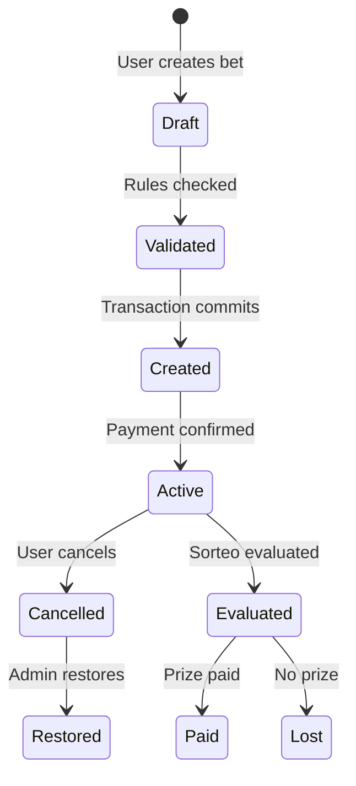

## Overview

The ticket creation system handles lottery bet registration with multi-layer validation, restriction rules enforcement, commission calculation, and transactional safety. All tickets go through a secure flow that ensures data integrity and compliance with betting limits.

## Ticket Lifecycle



## Creating a Ticket

<Steps>
  <Step title="Select sorteo and validate status">
    The sorteo must be in `OPEN` status. Tickets cannot be created for `SCHEDULED`, `CLOSED`, or `EVALUATED` sorteos.

    ```typescript
    // Example validation from ticket.service.ts
    if (sorteo.status !== 'OPEN') {
      throw new AppError(
        `Sorteo must be OPEN to create tickets. Current status: ${sorteo.status}`,
        422
      );
    }
    ```
  </Step>

  <Step title="Check sales cutoff time">
    The system enforces a sales cutoff period before the sorteo draw time. This is resolved hierarchically:

    **Priority chain:**
    1. `RestrictionRule.salesCutoffMinutes` (User → Ventana → Banca)
    2. `Loteria.rulesJson.closingTimeBeforeDraw`
    3. Default: 5 minutes

    ```typescript
    const cutoffMinutes = effectiveSalesCutoff || loteriaRules.closingTimeBeforeDraw || 5;
    const cutoffTime = new Date(sorteo.scheduledAt.getTime() - cutoffMinutes * 60000);
    
    if (now >= cutoffTime) {
      throw new AppError(
        `Sales are closed. Cutoff: ${cutoffMinutes} minutes before draw`,
        422
      );
    }
    ```
  </Step>

  <Step title="Create ticket with jugadas">
    Submit a POST request with ticket details and bet items (jugadas).

    <CodeGroup>
      ```bash cURL
      curl -X POST https://api.example.com/api/v1/tickets \
        -H "Authorization: Bearer YOUR_TOKEN" \
        -H "Content-Type: application/json" \
        -d '{
          "sorteoId": "uuid-sorteo",
          "jugadas": [
            {
              "number": "25",
              "amount": 1000,
              "betType": "NUMERO"
            },
            {
              "number": "42",
              "amount": 500,
              "betType": "NUMERO"
            },
            {
              "number": "25",
              "amount": 2000,
              "betType": "REVENTADO",
              "multiplierId": "uuid-multiplier"
            }
          ]
        }'
      ```

      ```javascript JavaScript
      const response = await fetch('/api/v1/tickets', {
        method: 'POST',
        headers: {
          'Authorization': `Bearer ${token}`,
          'Content-Type': 'application/json'
        },
        body: JSON.stringify({
          sorteoId: 'uuid-sorteo',
          jugadas: [
            { number: '25', amount: 1000, betType: 'NUMERO' },
            { number: '42', amount: 500, betType: 'NUMERO' },
            { 
              number: '25', 
              amount: 2000, 
              betType: 'REVENTADO',
              multiplierId: 'uuid-multiplier'
            }
          ]
        })
      });
      ```
    </CodeGroup>
  </Step>

  <Step title="System processes validations">
    The system automatically:
    - Validates number range (00-99 for 2-digit lotteries)
    - Checks `allowedBetTypes` from `Loteria.rulesJson`
    - Applies restriction rules (max per number, max per ticket)
    - Resolves base multiplier using priority chain
    - Calculates commissions with snapshot
    - Assigns sequential ticket number
  </Step>
</Steps>

## Validation Rules

### Number Range Validation

From `src/api/v1/controllers/ticket.controller.ts:11-20`:

```typescript
const result = await TicketService.create(
  req.body,
  userId,
  req.requestId,
  req.user!.role
);
```

The service validates:
- Numbers must be within `rulesJson.numberRange` (default: 00-99)
- REVENTADO bets require `requiresMatchingNumber` config
- Bet types must be in `allowedBetTypes` array

### Restriction Rules Application

<Note>
  Restriction rules are applied hierarchically with **first match wins** logic:
  - **User-level** (priority 100)
  - **Ventana-level** (priority 10)
  - **Banca-level** (priority 1)
</Note>

Example restriction enforcement:

```typescript
// From restriction rule logic
const maxAmountForNumber = getHighestPriorityRule(
  userRules,
  ventanaRules,
  bancaRules,
  { number, loteriaId, sorteoId }
);

if (jugadaAmount > maxAmountForNumber) {
  throw new AppError(
    `Amount ${jugadaAmount} exceeds limit ${maxAmountForNumber} for number ${number}`,
    422
  );
}
```

## Impersonation (VENTANA/ADMIN)

VENTANA and ADMIN users can create tickets on behalf of VENDEDOR users.

<CodeGroup>
  ```json VENTANA creates for vendedor
  {
    "sorteoId": "uuid-sorteo",
    "vendedorId": "uuid-vendedor",  // Must belong to same ventana
    "jugadas": [...]
  }
  ```

  ```json ADMIN creates for any vendedor
  {
    "sorteoId": "uuid-sorteo",
    "vendedorId": "uuid-vendedor",  // Any valid VENDEDOR
    "jugadas": [...]
  }
  ```
</CodeGroup>

**Rules from `ticket.controller.ts:11-20`:**
- VENDEDOR role: `vendedorId` is ignored, uses authenticated user
- VENTANA role: `vendedorId` must belong to same `ventanaId`
- ADMIN role: Can use any valid `vendedorId` with VENDEDOR role
- The ticket's `ventanaId` is always from the effective vendedor

## Managing Existing Tickets

### List Tickets

```bash
GET /api/v1/tickets?page=1&pageSize=20&scope=mine&date=today
```

**Query parameters:**
- `scope`: `mine` | `all` (RBAC-filtered)
- `date`: `today` | `yesterday` | `week` | `month` | `range`
- `fromDate`, `toDate`: For `date=range` (YYYY-MM-DD)
- `sorteoId`: Filter by specific sorteo
- `loteriaId`: Filter by lottery
- `winnersOnly`: Boolean, only winning tickets
- `number`: Filter by bet number
- `isActive`: Boolean, active/cancelled tickets

### Get Ticket Details

```bash
GET /api/v1/tickets/:id
```

Returns full ticket with:
- Jugadas (bets) with commission snapshots
- Sorteo details
- Payment history
- Evaluation results (if evaluated)

### Cancel a Ticket

```bash
POST /api/v1/tickets/:id/cancel
```

From `src/api/v1/controllers/ticket.controller.ts:155-159`:

```typescript
async cancel(req: AuthenticatedRequest, res: Response) {
  const userId = req.user!.id;
  const result = await TicketService.cancel(req.params.id, userId, req.requestId);
  return success(res, result);
}
```

<Warning>
  - Cancellation is a **soft delete** (`isActive = false`)
  - Only ADMIN can restore cancelled tickets
  - Cancelled tickets are excluded from evaluation
</Warning>

### Restore a Ticket

```bash
POST /api/v1/tickets/:id/restore
```

**Access:** ADMIN only

From `src/api/v1/controllers/ticket.controller.ts:161-165`:

```typescript
async restore(req: AuthenticatedRequest, res: Response) {
  const userId = req.user!.id;
  const result = await TicketService.restore(req.params.id, userId, req.requestId);
  return success(res, result);
}
```

## Commission Snapshot

Every jugada includes an immutable commission snapshot at creation time:

```typescript
{
  commissionPercent: 8.5,        // 0-100
  commissionAmount: 4.25,         // round2(amount * percent / 100)
  commissionOrigin: "USER",       // "USER" | "VENTANA" | "BANCA" | null
  commissionRuleId: "rule-uuid"   // ID of applied rule or null
}
```

**Resolution priority:**
1. User commission policy
2. Ventana commission policy
3. Banca commission policy
4. Default: 0%

## Transactional Safety

All ticket creation uses `withTransactionRetry` from `src/core/withConnectionRetry.ts`:

- **Deadlock handling:** Exponential backoff on P2034 errors
- **Timeout protection:** Explicit transaction timeout
- **Atomic operations:** Sequential ticket number + restriction check + creation
- **Activity logging:** Asynchronous audit trail

## Filter Options API

Get available filter values based on actual tickets:

```bash
GET /api/v1/tickets/filter-options?scope=mine&date=today
```

From `src/api/v1/controllers/ticket.controller.ts:879-946`:

Returns:
```json
{
  "loterias": [{"id": "uuid", "name": "Lotería Nacional", "count": 45}],
  "sorteos": [{"id": "uuid", "name": "12:55 PM", "count": 23}],
  "multipliers": [{"id": "uuid", "name": "Base", "count": 40}],
  "vendedores": [{"id": "uuid", "name": "Juan Pérez", "count": 15}],
  "meta": {"totalTickets": 45}
}
```

## Best Practices

<AccordionGroup>
  <Accordion title="Always validate sorteo status before UI">
    Fetch sorteo details and check `status === 'OPEN'` before showing ticket creation form.
  </Accordion>

  <Accordion title="Handle cutoff times gracefully">
    Display remaining time to cutoff. Refresh sorteo status periodically.
  </Accordion>

  <Accordion title="Batch number lookups">
    Use `/tickets/numbers-summary` to get aggregated bet amounts per number before creating tickets.
  </Accordion>

  <Accordion title="Implement idempotency">
    Store `requestId` client-side to prevent duplicate submissions on network retry.
  </Accordion>
</AccordionGroup>

## Related Endpoints

- [Sorteo Management](/guides/sorteo-management) - Understanding sorteo lifecycle
- [Restriction Rules](/guides/restriction-rules) - Setting up betting limits
- [Payments](/guides/payments) - Processing winning ticket payments
- [Analytics](/guides/analytics) - Ticket statistics and reports